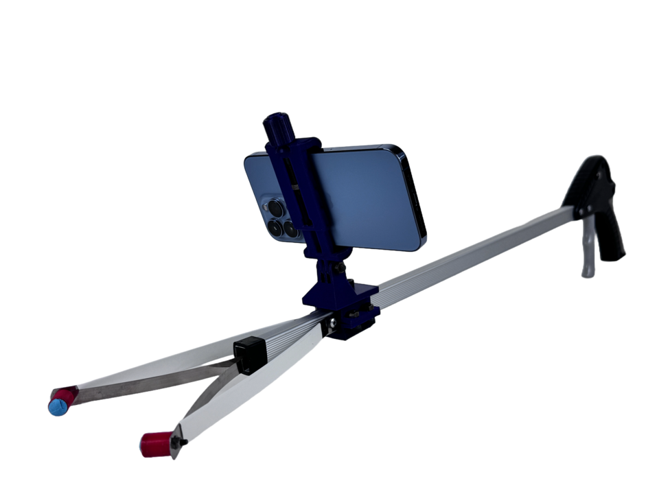
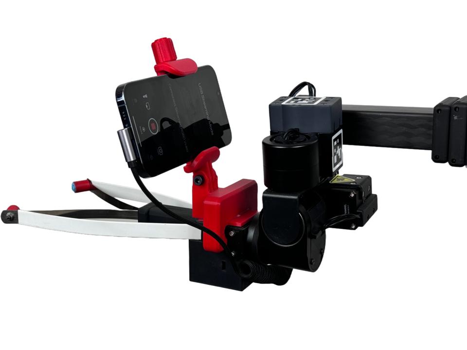
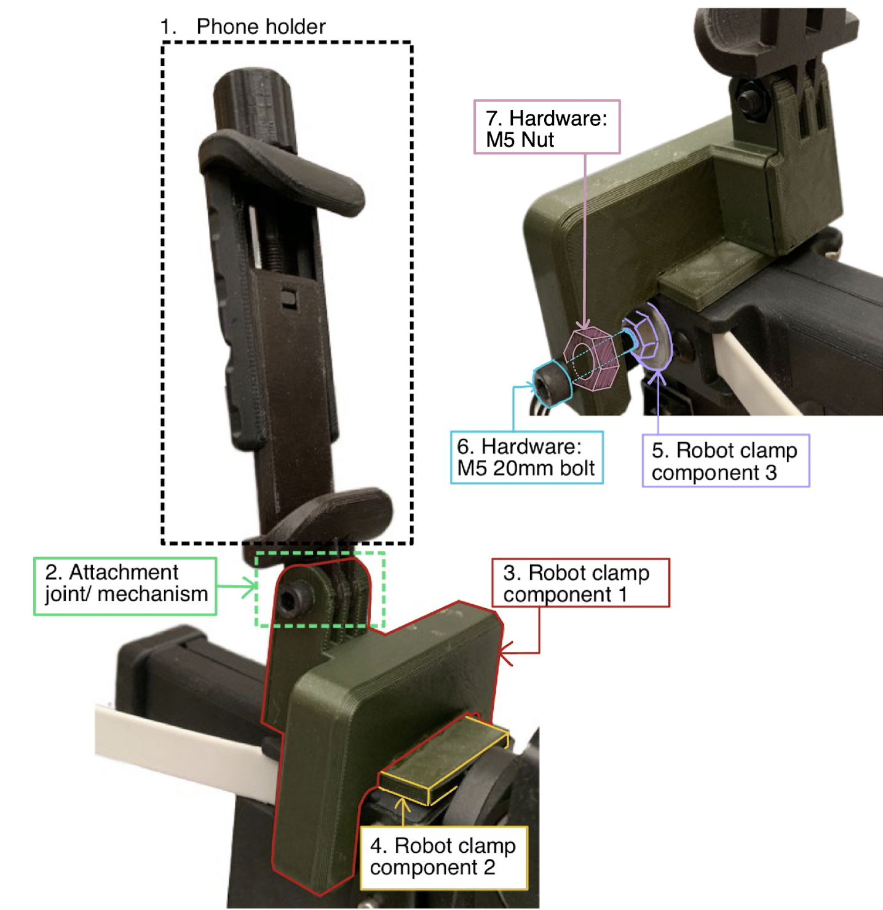
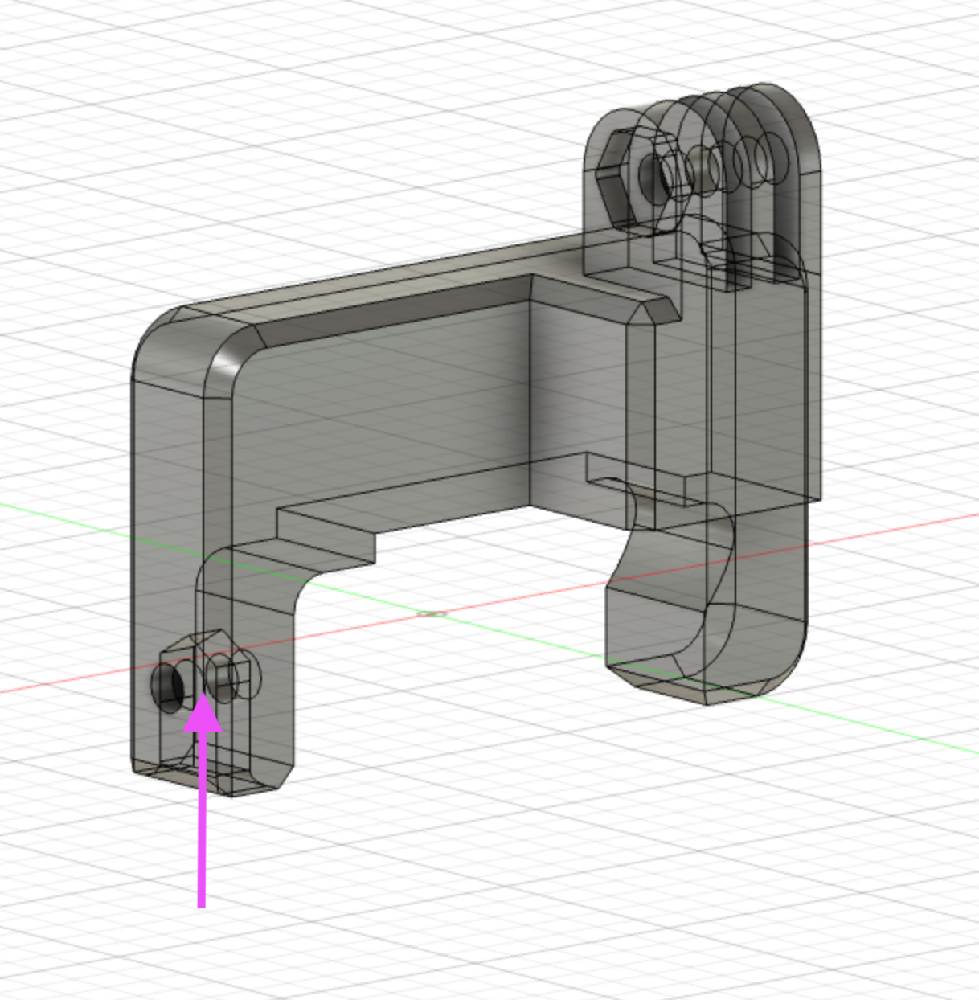
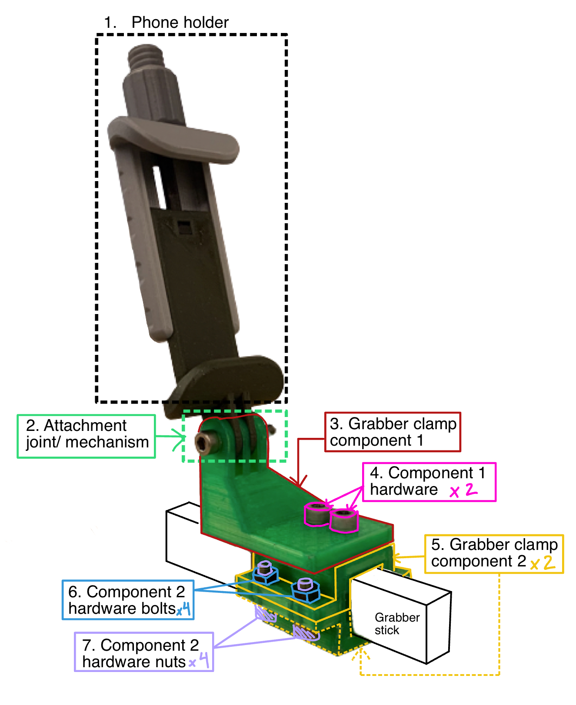
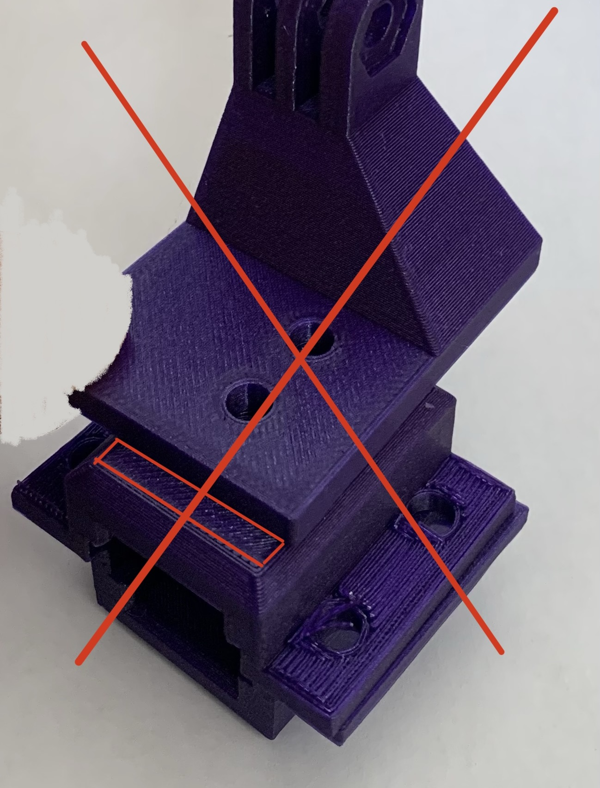
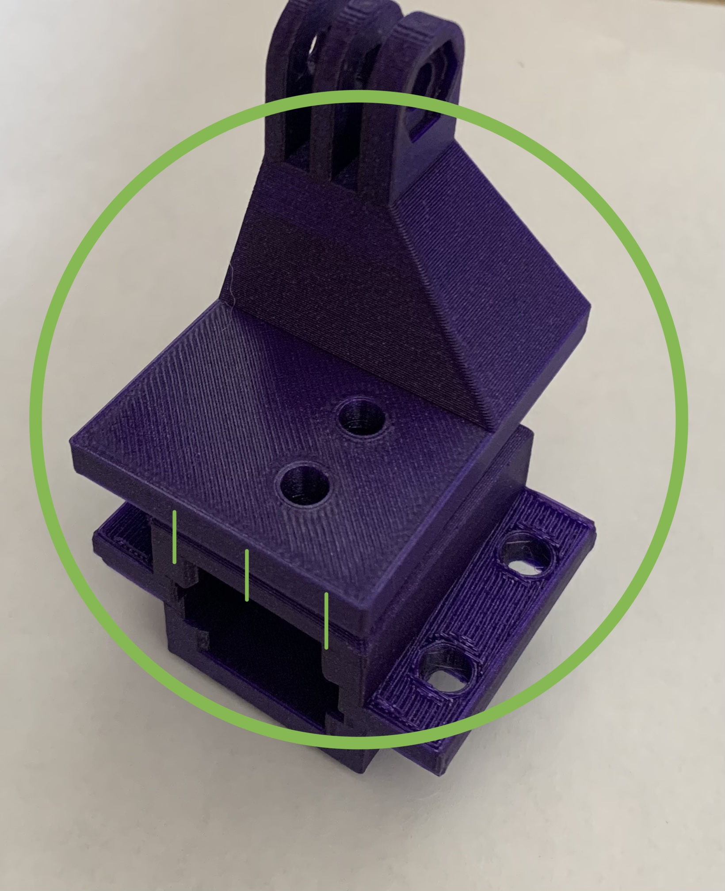
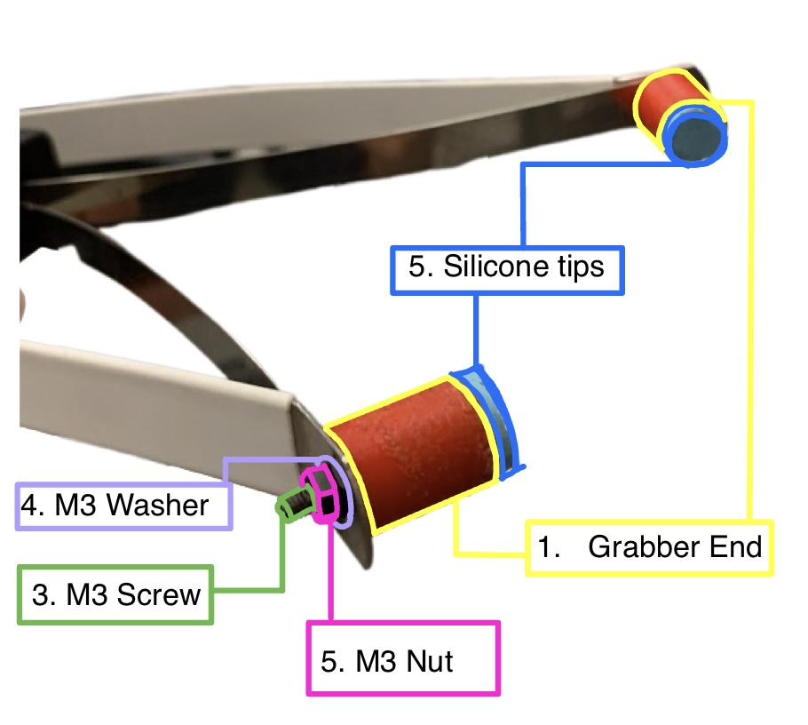

# Stick Stocks

**Special thanks to [Anya Zorin](https://www.linkedin.com/in/anya-zorin/) and [Jyo Pari](https://jyopari.github.io/) for their help in designing and testing these stocks.**

## Full Picture
### Stick

### Robot gripper

These stocks were designed for collecting data and running expirements at the [NYU Generalized Robotics and AI Lab](https://lerrelpinto.com) using the [Hello Robot Stretch](https://hello-robot.com/product) with an iPhone as an egocentric camera. For data collection the iPhone was mounter to a manual [grabber tool](https://www.amazon.com/Vive-Suction-Reacher-Grabber-Pack/dp/B07GFL168C/ref=sr_1_7?keywords=grabber+tool+suction+cups&sr=8-7), and calibrated to be at the same perspective as the iPhone on the robot. Over time the design has been adjusted to fit the specific setup by adjusting height and setback of the clamps so that the two views are properly aligned, with the tips of the gradder arm as points of reference.

## [Bill of Materials](https://docs.google.com/spreadsheets/d/1qkDV2W64Q2eQ5Y6DkTYfokI8hO4we7ong_2VNufDRaY/edit?usp=sharing) 
All necessary materials and hardware for this setup is listed in the Bill of Materials.

## 3D Printing and Files
Each different stock has its own folder, within each part has its folder conatining the following parts for each file: .STEP, .STL, .gcode, and a .f3d file. 
For the stocks, most parts are 3D printed on the [Original Prusa i3 MK3S+](https://www.prusa3d.com/category/original-prusa-i3-mk3s/), so the gcode is for that specific printer. 

## Phone Holder
### The phone holder is taken from the [Modular Mounting System by HeyVye](https://www.thingiverse.com/thing:2194278), which is licensed under the [Creative Commons - Attribution](https://creativecommons.org/licenses/by/4.0/) license.

It uses the Mount Phone Clamp, and the print files, print instructions, and instructions for assembly are all on the linked page. The files are also provided in the folder [PhoneHolder](PhoneHolder/)

For the hardware, instead of a printed bolt and nut, a M5 35mm bolt and a M5 nut for better durability and performance. 

The attachment joint/mechanism is taken from this system, but it is important to note that within the system the joint is inspired from a gopro mount joint, so it will work with a standard gopro mount as well. There is more on this in the [Attachment Joint/Mechanism](#attachment-jointmechanism) section. 

<!-- [PhoneClamp_body1.stl](PhoneHolder/PhoneClamp_body1.stl)

[PhoneClamp_body2.stl](PhoneHolder/PhoneClamp_body2.stl)

[PhoneClamp_Knob.stl](PhoneHolder/PhoneClamp_Knob.stl) -->
## Robot Clamp

### Part Files
1. [Phone Holder](#phone-holder)
2. [Attachment joint/mechanism](#attachment-jointmechanism)
3. Clamp Component 1: [robotClamp.stl](RobotClamp/robotClamp)
4. Clamp Component 2: [robotClamp_insert.stl](RobotClamp/robotClamp_insert/)
5. Clamp Component 3: [robotClamp_pad.stl](RobotClamp/robotClamp_pad.stl)

### Hardware and other items for assembly
6. 1 x M5 20mm bolt, socket head
7. 1 x M5 nut
- [Gorilla Super Gel Glue](https://www.amazon.com/Gorilla-7700108-2-Pack-Super-Clear/dp/B00OAAUAX8?source=ps-sl-shoppingads-lpcontext&ref_=fplfs&smid=ATVPDKIKX0DER&th=1)

### Assembly Instructions
1. Print necessary files. Each respective file folder contains suggested print, support, and orientation settings. 
2. Assemble phone holder using instructions in the [Phone Holder](#phone-holder) section. 
3. Take the robot clamp components 1 and 2 ([robotClamp.stl](RobotClamp/robotClamp.stl) and [robotClamp_insert.stl](RobotClamp/robotClamp_insert.stl)), add super glue to the underpart of component 1 in which component 2 can be inserted into. 
4. Press component 2 into component 1 where the glue has been applied, such that component 2 is centered and equal amounts stick out from the clamp. Hold down for at least 15 sec. (Note that the glue takes around a day to fully set)
5. Insert nut into slot as shown in image

6. Insert screw/bolt into hole, thread through the nut that was inserted into clamp at step 5 using a 4mm allen key, and once the end is visible, thread the silver end pad([Robot clamp component 3](RobotClamp/robotClamp_pad.stl)) onto the end of the screw. 

7. Follow the instructions in the [attachment mechanism](#attachment-jointmechanism) section to attach the phone holder. 

## Grabber Clamp

### Part Files
1. [Phone Holder](#phone-holder)
2. [Attachment joint/mechanism](#attachment-jointmechanism)
3. [Grabber Clamp Component 1](GrabberClamp/grabberClamp_top.stl)
5. [Grabber Clamp Component Top and Bottom](GrabberClamp/grabberClamp_body/)

### Hardware
4. 2 x M5 10mm bolts
6. 4 x M5 nuts
7. 4 x M5 12mm bolts

### Assembly Instructions
1. Print necessary files. Each respective file folder contains suggested print, support, and orientation settings. 
2. Take the two clamp body component 2, and press them together around the clamp as shown in the diagram, making sure the holes align. The holes oriented such that they are closer to the tips than where you hold the stick.
3. Take the #7 (the 4 M5 12mm bolts) and the 4 M5 nuts and use them to attach the two peices together with a 4mm allen key, but do not tighten all the way down, first get all the bolts secure with the nuts. 
4. Once all the bolts and nuts are in place, tighten one down until you feel resistence, then do the same with the diagonal one, and repeat for the remaining two. Continue this criss cross pattern of tightening till the clamp is secure. Using this method ensures that the clamp is not tightened at an angle and the bolts are tightened evenly. This is important, because if the clamp is attached at an angle, the camera view may also be tilted.
5. Place the grabber component 1 ([grabberClamp_top.stl](GrabberClamp/grabberClamp_top.stl)) on top of the clamp and line up the holes on the part and the clamp. The back of component 1 should align with the back of the clamp. There should be none of the top of the component 2 visible. 

6. Take the two M5 10mm bolts and screw them into the top piece with a 4mm allen key, and then into the clamp. The bolts will thread into the plastic and be secure. Do not remove these bolts and rescrew them because this will strip the threads created by the first time you secured the part. 
7.  Follow the instructions in the [attachment mechanism](#attachment-jointmechanism) section to attach the phone holder. 
## Grabber Ends

### Part Files
1. [Grabber End](GrabberEnds/grabberEnd.stl)
2. [Grabber End Mold](GrabberEnds/grabberEnd_mold.stl)

### Hardware
3. M3 8mm socket head bolt
4. M3 Washer
5. M3 Nut

### Other Materials
6. Two part silicone ([Oomoo 25](https://www.amazon.com/Smooth-OOMOO-25-Curing-Silicone/dp/B01C4YQ4TU/ref=sr_1_3?keywords=oomoo+25&sr=8-3))
7. Tape (of any kind)
8. [Gorilla Super Gel Glue](https://www.amazon.com/Gorilla-7700108-2-Pack-Super-Clear/dp/B00OAAUAX8?source=ps-sl-shoppingads-lpcontext&ref_=fplfs&smid=ATVPDKIKX0DER&th=1)

### Molding Process for Silicone Tips
1. Pre mix the silicone as instructed on the box
2. Take the two halves of the molds and tape them together as in the image. Make sure that the bottom is flat by placing on a flat surface while taping. 
3. Pour the silicone in to the mold. 
4. Let it cure for the amount of time specified on the box, and then untape the two peices and gently remove the silicone tip. 

### Assembly Video
(Coming soon.)

### Assembly instructions
1. Take the printed red tip ([Grabber End](GrabberEnds/grabberEnd.stl)) and insert the M3 8mm bolt into the tip as shown in the video. You may have to push it all the way down with a 2mm allen key. 
2. Take the glue and line the inside of the tip with it.
3. Press the silisone tip into the red end and press it down for at least 30 seconds. It is important to use the listed glue as it bonds to both silicone and plastic. 
4. Remove the stock ends of the grabber hand, and attach the new end by first inserting the bolt through the hole, then putting the M3 Washer, and then screwing the M3 Bolt onto the bolt.
5. To secure the bolt, use a small adjustable wrench, or sometimes simply using your hand will tighten the end enough. 
6. Repeat this process for the other side. 

## Attachment Joint/Mechanism
The attachment mechanism used is inspired from the GoPro Mounting system, so this system wil also work with any standard GoPro mounts.

### Hardware
1. M5 20mm socket head
2. M5 Nut

### Instructions
1. Take the two pieces you are trying to attach together (i.e. phone holder and robot clamp) and locate the attachment point as in the picture:

2. These two peices slot together, and the center holes should align. Make sure that the peices are oriented correctly by referring to the [Full Assembly](#full-picture). 
3. Insert the M5 bolt from the side that does *not* have a hexagonal indentation. 
4. Once the bolt is all the way through, screw the M5 nut on from the other side, and tighten using a 4mm allen key, and a small wrench if needed. 

## Tilt Calibration
When calibrating the tilt of the iPhones, since the attachment joint is adjustable, the app [Precise Level: Spirit Level](https://apps.apple.com/us/app/precise-level-spirit-level/id1093293519) was used. Put the stick on a surface level to the ground like in the image below and calibrate. Find a block that the robot clamp can fit on (a lot of charging blocks work) and place it on a level surface, then calibrate using the app. Then place back on robot.  
